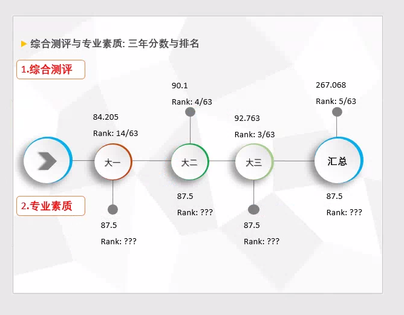

### 答辩时间规划

10分钟: 5分钟PPT讲解，5分钟回答提问

**PPT设计：** 10页PPT, 有效讲解PPT`5页`-- 使用`4分30秒`

**讲解目标：** 特殊学术专长(比赛，项目和技能)， 培养潜质(综合测评与专业素养)
**回答提问：** 直接回答老师的问题，间接明了，如果老师让你扩展一下，就可以表述自己的观点。

#### PPT讲解时间规划

PPT讲解时间控制的话，需要自己控制自己的重点讲解内容，每一页PPT单独练习，控制好每一页PPT自己的讲解时间，最好就把每一页自己PPT要讲解的内容写出来草稿。然后自己读几遍，修改每一个句子，力求使用最简单的语句表述出来自己想表达的内容。 这里可以找其他对你不了解的同学，听一遍你完整讲解的内容，如果他理解了，就说明你的内容逻辑比较好，如果他理解有偏差，那就需要你和他交流找到他会产生误解的地方，然后着重修改这个部分，让他人能够听一次就明白。

1. 讲解专业成绩部分 - 1分钟

**重点：** 需要在这里指出，第一年自己的综合测评排名低，是因为自己从其他学院转过来，很多在综合测评上需要班级学院贡献的加分项都是不能够加分的。

2. 重点比赛获奖情况 - 1分钟

**重点：** 可以着重介绍一下美赛自己的工作内容

3. 项目经历 - 1分钟

4. 研究生期间机会 - 1分钟

******
剩余的1分钟， 用于中间过其他的PPT内容

### 格式问题修改

1. 16：9的宽屏PPT转换为4:3的PPT，因为答辩时候的屏幕大部分是4:3的屏幕，如果使用16:9的PPT，在下面看起来，整体会显得比较小。

2. PPT使用后缀为`*.ppt`，不要使用`*.pptx`, 后面这种格式老版本的`Office`是不支持的

3. 答辩的时候，准备PPT之余，记得要转成一份PDF以备万一。

### 内容修改

1. 如果能够找到的话，放一个云南大学的图案在PPT上方。下面是例子。

2. 答辩中需要用到的专业素质分，说的是你综合测评表格里面，每年的专业那一项得分，你需要填写这三年如果单单只计算专业成绩的话，你每一年的专业成绩排名是多少。(不需要计算每个学期的，简单的说明就好了，主要是证明排名，这个可以证明你的专业课的学习能力)

3. 不需要把奖章全部贴上去，反正放上去，到时候下面的人也看不清。

以公开答辩的方式选有特殊学术专长或具有突出培养潜质的推免生候选人。

4. 加入简历上面的专业技能内容，精炼一些

5. 添加重点奖项的概括工作部分，如果不添加的话，需要做好草稿，到时候讲解。

6. 自己添加一下奖项的完整信息。太小的奖项不用写上去。

7. 项目经历的排版稍微在美观一些

## 其他细节

1. 准备好PPT版本以及PDF版本自己的答辩内容

2. 提前到答辩教室测试自己的PPT

3. 讲解的时候，可以放一个小笔记本在讲台上面，提示自己每一页讲解的摘要，但是不要写太多，也不要多去看草稿。

4. 不要完全读PPT......PPT上面只有摘要信息，自己提前大脑里准备好。
   
5. 讲解的时候，人要站直，手不要放在讲台上面，只要在换PPT的时候，手才去接触鼠标，使用身体姿势或者手势和台下的人交互。