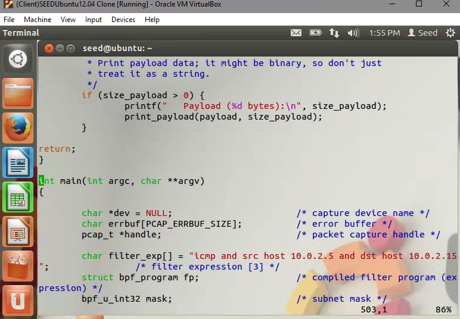

## CPSC Project 1: Packet Sniffing and Spoofing

> CPSC 8580 Project1
> Guoze Tang
> 09/19/2018

### Task 1: Writing Packet Sniffing Program

I just downloe the `sniffex.c` file from the [Programming with pcap](https://www.tcpdump.org/pcap.html) website.

#### Install the `libpcap`

Firstly, we need install the `libpcap` on the Ubuntu. I don't need install it anymore because the VM from the SEED have installed the `libpcap` lib. I just check the lib file to make sure that I can use the `libpcap` lib in the next work.


#### Compile the file

In order to compile the `sniffex.c`, I write a `Makefile` to help me compile it. The `Makefile` file just like the followed.


```Makefile
CXX = gcc

# Warnings frequently signal eventual errors:
CXXFLAGS= -Wall

OBJS = \
	sniffex.o
EXEC = run

%.o: %.c
	$(CXX) $(CXXFLAGS) -c $< -o $@

$(EXEC): $(OBJS)
	$(CXX) $(CXXFLAGS) -o $@ $(OBJS) $(LDFLAGS) -lpcap

sniffex.o: sniffex.c

clean:
	rm -rf $(OBJS)
	rm -rf $(EXEC)
```

I use `-lpcap` to assign the library with the `sniffex.o` file.

**Output of the compile**


#### Execute the program

Use `sudo ./run` to execute the sniffing program. 


Then, the program will print the information about the device, the number of packets and the information about the packet.

```cpp
Device: eth15
Number of packets: 10
Filter expression: ip
```

These printing information just tell the user about how many packets this sniffing program will be capture. And it just capture the packets from the `Device: eth15`. It will be stop after it have captured 10 packets.

```cpp
Packet number 1:
       From: 10.0.2.4
         To: 104.239.207.44
   Protocol: TCP
   Src port: 49786
   Dst port: 443

```

And, this is the packet information to give us the summary about the `Protocol`, `Src IP`, `Dst IP`, `Sro port`, and `Dst port`.

******

**Problem 1:**

> Please use your own words to describe the sequence of the library calls that are essential for sniffer programs. This is meant to be a summary, not detailed explanation like the one in the tutorial.

In my opinion, the sequence of the library calls that are essential for sniffer program include the followed steps.

1. Choose the source of the packet. (From device or file) This step uses the `pcap_lookupdev` funciton in the lib.

2. Open the source device or file and create a sniffing session tp record the packets. This step use the `pcap_t *pcap_open_live` function in the lib.

3. Configure the sniffing session to filter the traffic. This step uses the `int pcap_compile` or `int pcap_setfilter` funcitons in the lib.

**Problem 2:**

> Why do you need the root privilege to run sniffex? Where does the program fail if executed without the root privilege?

If we don't use root privilege to run sniffex, the output is `Couldn't find default device: no suitable device found`. Because if you don't use the root privilege, this program can't get the device information from the system by use the call `pcap_lookupdev`.


As a results, I read the `sniffex.c` in order to find the detailed information about this notication. I found the reason is the `pcap_lookupdev` can't get the device information from the Linux system.


******

**Problem 3:**

> Please turn on and turn off the promiscuous mode in the sniffer program. Can you demon-strate the difference when this mode is on and off? Please describe how you demonstrate this.

What is the promiscuous mode?

In a network, promiscuous mode allows a network device to intercept and read each network packet that arrives in its entirety. (From: https://searchsecurity.techtarget.com/definition/promiscuous-mode)

Firstly, I build a local network use three VM Ubuntu. They are the `Server`, `Client`, and `Client2`. Like followed:


And the IP address for these VM are:

```bash
Server IP: 10.0.2.15
Client2 IP: 10.0.2.5
Client IP: 10.0.2.4
```

On the Client VM, I changed the code in the `sniffex.c` to turn on the promiscuous mode.


Just need to change the `third parameter` in the `pcap_open_live` function. 

`handle = pcap_open_live(dev, SNAP_LEN, 1, 1000, errbuf);`

Change it to `1` from `0`.

After that, I use the `Server` to ping the `Client2` VM. 


Then, I can find the `Client` VM can capture the network traffic even if only the `Client2` and `Server` VM have a conversation in the network. 

So the promiscuous mode just like you can capture all the network packets in the local network evne these packets weren't sent to you.

**Turn of promiscuous mode.**

Change to `0` from `1`.

`handle = pcap_open_live(dev, SNAP_LEN, 0, 1000, errbuf);`

And do the same work again.


I can find, the sniffing program can't capture the packets if thsee packets don't send to `Client` VM. And It only can capture these packets which was sent to the `Client` VM.


******

**Problem 4:**
> Please write filter expressions to capture each of the followings. In your lab reports, you need to include screendumps to show the results of applying each of these filters.
> - Capture the ICMP packets between two specific hosts.
> - Capture the TCP packets that have a destination port range from to port 10 - 100.

In this case, I use `Client` , `Client2`, and `Server` VM to do this work. 

```bash
Server IP: 10.0.2.15
Client2 IP: 10.0.2.5
Client IP: 10.0.2.4
```

The sniffing program is executing on the `Client` VM. Use the `Client2` and `Server` VM call `ping` funciton to send some `ICMP` packets to `Client`.

**Filter the Src IP**

Filter the Src IP: 10.0.2.5(Client2) and Dst IP: 10.0.2.15 (Client) and the `ICMP` packets.



I get the output:


Even through the `Server` VM send some packets to `Client`, but the sniffing program doesn't capture these packets.


**Capture the TCP packets that have a destination port range from to port 10 - 100.**

Filter the `dst portrange 10-100` and the `TCP` packets.


In this case, I need to make some `TCP` packets. So I just use the `wget` command to download a web page. And the web server will send this web page by FTP packets to me.

`wget http://guozet.me/post/C++-initialization-of-variable/`


