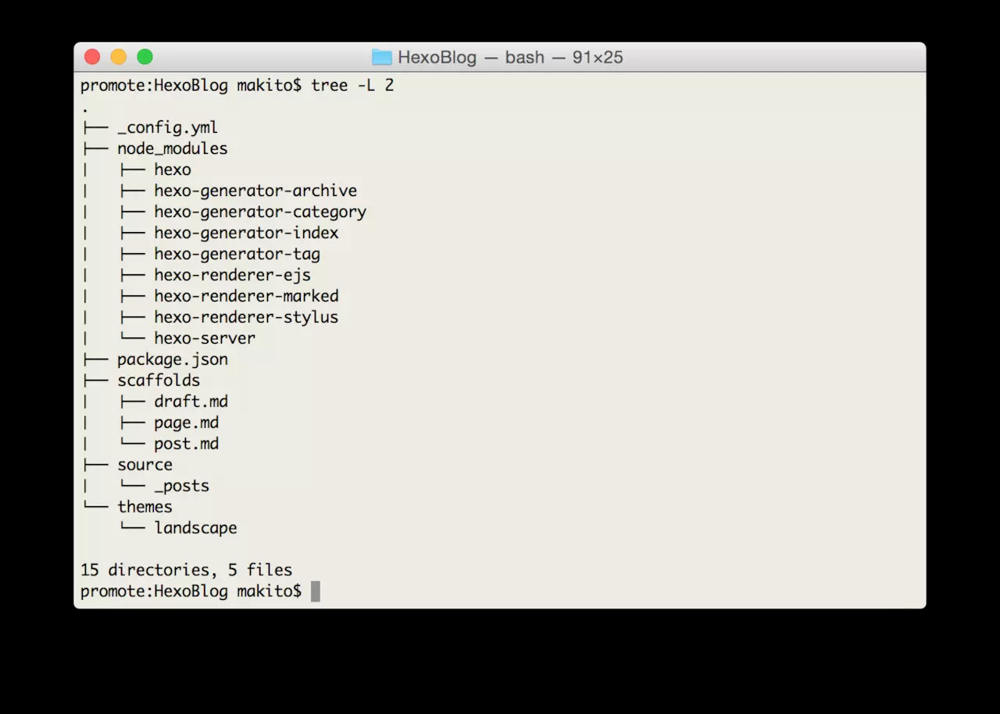

> 很多时候我们是需要在不同的电脑上面书写我们的博客，但是每次都要配置Hexo的环境的话，这就是一件非常崩溃的事情，所以我们需要利用我们的知识完成自动化部署。

**原理：** 在github上面创建Blog的repo, 使用master分支作为博客分支，使用hexo来作为源文件保存分支，将该repo的token key 提供给Travis之后，Travis CI平台检测你的hexo分支数据变化的时候，就会执行你定义的脚本。（在这个脚本中，完成博客发布的内容）

## 使用Travis CI

2018-08-09-hexo-and-travisci-to-implement-auto-setting_2018-08-09-14-36-40.png</img>